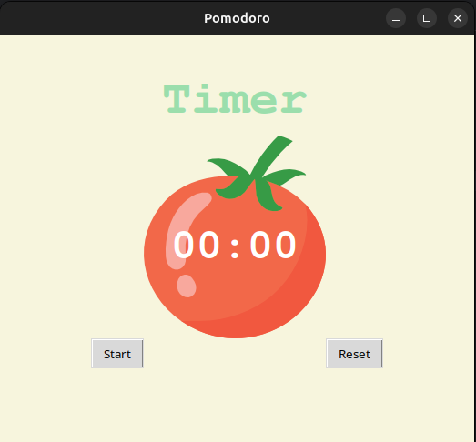

# 🍅 Pomodoro Timer

A simple and functional **Pomodoro Timer** built using **Python's Tkinter library**. This timer helps you follow the **Pomodoro Technique** — a time management method that alternates work sessions with short and long breaks to boost productivity.

## 🚀 Features

- ✅ 25-minute work sessions
- ⏸️ 5-minute short breaks
- 💤 20-minute long breaks after every 4 work sessions
- 🔁 Auto-restart next session after countdown ends
- 🔄 Reset functionality to restart the timer anytime
- ✔️ Progress checkmarks to track completed sessions
- 🖼️ Tomato-themed UI for a visual Pomodoro touch

## 🧰 Tech Stack

- Python 3
- Tkinter (Standard GUI library)
- `math` module for time calculations

## 📸 UI Preview

> 💡 You can include a screenshot of your app here  
> Example:
> 

## 🛠️ How to Run

1. Make sure you have Python installed (version 3+ recommended).

2. Clone this repository or download the `main.py` file.

3. Place a `tomato.png` image in the same directory as the script.

4. Run the script:
```bash
python main.py
